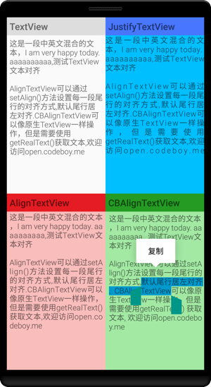

AlignTextView
--- 
#### **字体对齐的TextView**

[](https://maven-badges.herokuapp.com/maven-central/me.codeboy.android/align-text-view)
  

  
## 系统要求
Android 4.0以上

## 快速使用

**build.gradle加入dependencies**

    compile 'me.codeboy.android:align-text-view:2.3.2'

**AlignTextView (不支持选择复制，在不需要进行选择复制的情况下使用，排版效果好)**

     <me.codeboy.android.aligntextview.AlignTextView
            android:id="@+id/alignTv"
            android:layout_width="match_parent"
            android:layout_height="wrap_content"/>


**CBAlignTextView (新的版本，支持选择复制，排版效果比较的好)**

    <me.codeboy.android.aligntextview.CBAlignTextView
            android:id="@+id/cbAlignTv"
            android:textIsSelectable="true"
            android:layout_width="match_parent"
            android:layout_height="wrap_content"/>


如果需要支持android默认的选择复制，请在xml中加入以下代码:

    android:textIsSelectable="true"

## 相关方法

#### 1.CBAlignTextView

CBAlignTextView中增加了以下方法获取TextView的文本内容，请不要使用getText()获取

```
getRealText()
```   
由于Android L(5.0)之后对中文的版本进行了变化，造成不能由中文标点作为行首，所以为了能够使CBAlignTextView看起来更加工整，建议将中文符号用英文符号替换(默认不转换)，可以通过以下三种方式转化

- 使用转化函数转化标点符号:

	```
	CBAlignTextViewUtil.replacePunctuation(String text)
	```   
   
- 在设置CBAlignTextView文本前(setText),调用以下方法:
 	
 	```
    setPunctuationConvert(boolean convert)
    ```

- 如果需要多次设置文本，或者复用组件(如RecyclerView中)，在后面每次设置文本前，请调用以下方法:

	```
   reset()
   ```
    

- 可以直接在xml布局中进行设置

	```
   <LinearLayout xmlns:android="http://schemas.android.com/apk/res/android"
      xmlns:cb="http://schemas.android.com/apk/res-auto"
      android:layout_width="match_parent"
      android:layout_height="match_parent"
      android:orientation="vertical">
      <me.codeboy.android.aligntextview.CBAlignTextView
            android:id="@+id/cbAlignTextView"
            android:layout_width="match_parent"
            android:layout_height="wrap_content"
            cb:punctuationConvert="true"
            android:textIsSelectable="true"
            android:textSize="14dsp"/>    
	</LinearLayout>
	```

#### 2.AlignTextView
AlignTextView是旧的版本，不支持选择复制，但是可以自定义最后一行的对齐方式

```
setAlign(Align align)
```
	
设置每一段最后一行对齐方式，默认居左对齐，同时也可以在xml注释中设置对其方式:

```
<LinearLayout xmlns:android="http://schemas.android.com/apk/res/android"
          android:layout_width="match_parent"
  android:layout_height="match_parent"
  android:orientation="vertical">
  <me.codeboy.android.aligntextview.AlignTextView
        android:id="@+id/alignTextView"
        android:layout_width="match_parent"
        android:layout_height="wrap_content"
        cb:align="center"
        android:textSize="14dsp"/>    
</LinearLayout>
```

## 使用说明
1.  不用进行选择复制的时候使用 `AlignTextView`,需要进行选择复制的时候使用`CBAlignTextView`。
2.  `AlignTextView`与`CBAlignTextView`在对齐的时候不会对英文单词等进行考虑，它们都是以字符(character)为基础的,不是词(word)。
3.  使用CBAlignTextView时建议进行中文标点的转换。 
4.  demo项目位与app下，可以单独提取出me.codeboy.android.aligntextview.AlignTextView和me.codeboy.android.aligntextview.CBAlignTextView使用。

## 更新历史

### v2.3.2
1. 修复CBAlignTextView多次设置文本后空行的问题。

### v2.3.1
1. 修复CBAlignTextView在xml中设置text时空指针问题。
1. 修复CBAlignTextView设置空文本无效问题。

## License

```
Copyright 2016 Yuedong.li

Licensed under the Apache License, Version 2.0 (the "License");
you may not use this file except in compliance with the License.
You may obtain a copy of the License at

   http://www.apache.org/licenses/LICENSE-2.0

Unless required by applicable law or agreed to in writing, software
distributed under the License is distributed on an "AS IS" BASIS,
WITHOUT WARRANTIES OR CONDITIONS OF ANY KIND, either express or implied.
See the License for the specific language governing permissions and
limitations under the License.
```

> 有任何问题,欢迎发送邮件到app@codeboy.me交流.


